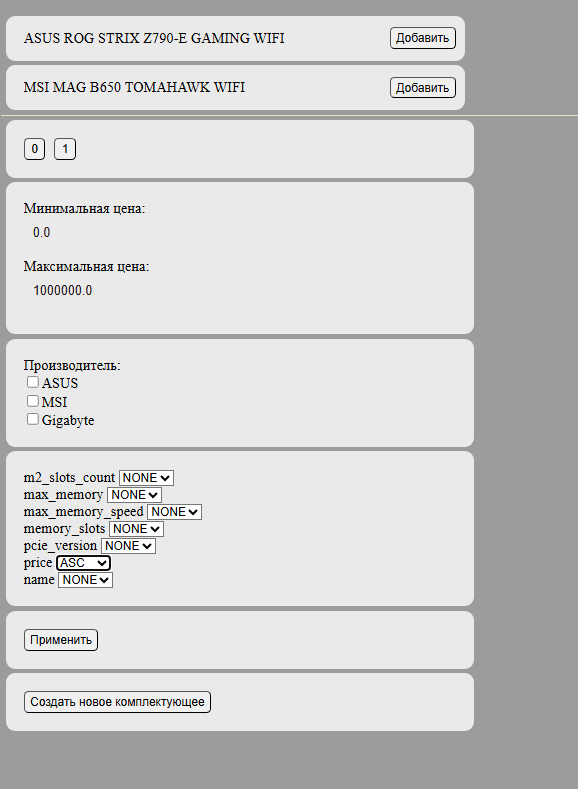
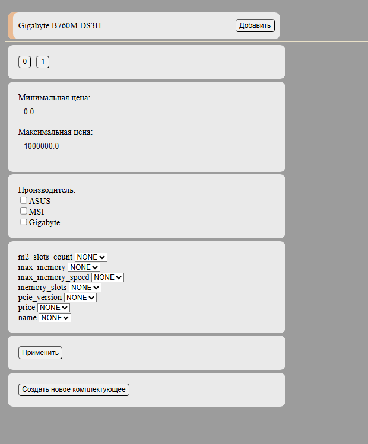
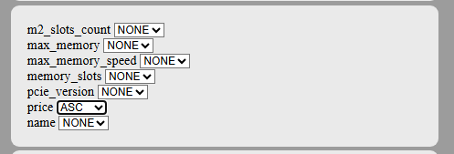
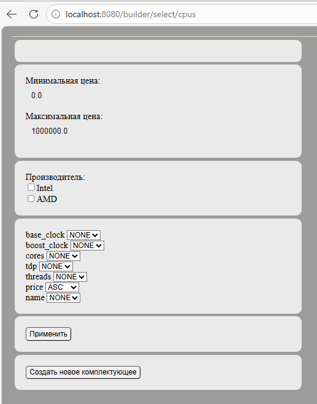

# Pc builder
## Описание
Пет-проект с использованием множества стартеров Spring framework.
Идея проекта - создание билдера, который позволит пользователю легко выбрать сборку пк, основное отличие от других похожих сервисов - интеллектуальная система, которая
по уже выбранным комплектующим показывает пользователю только те, которые к ним подойдут.
## Структура БД


Изначально было создано всего 4 таблицы - product_specification,
compatibility_rule, product_category, product.
Все поля в таблицах говорящие, поэтому я только опишу логику проверки вхождения
рассматриваемого продукта в список продуктов, которые возможно вставить в текущую сборку,
относительно продуктов, уже входящих в текущую сборку.

Для этого мы руководствуемся следующим:
Основой класс для работы с билдом(сборкой ПК) - com.hotking.pcbuilder.pcbuild.PcBuild,
В этом классе есть словарик, который хранит текущую сборку:
```java
//id продукта, количество комплектующего
private Map<Long, Integer> build = new LinkedHashMap<>();
```
```
Почему не храним сущность? 
Потому что дешевле хранить id вместо сущности.
Потому что мне с View слоя  передавать данные на контроллер, и лучше всего передавать id, опять же из-за экономии ресурсов.
Ну и наконец, потому что в логике мне необходимо отслеживать последний добавленный элемент в список, чтобы,
в случае, если пользователь как то его туда добавил, а он невалиден относительно ранее добавленных, мне нужно его от туда убрать,
а сущности при разных запросах создаются разные, следовательно сущность, как ключ нам не подойдет.
```

Так вот, у нас есть табличка compatibility_rule, которая, по сути, и выполняет всю работу по сравнению
текущее комплектующее - source_category_id,
то с которым сверяем - target_category_id,
operator :
```java
public enum Operator{
    EQUALS,
    NOT_EQUALS,
    GREATER_THAN,
    LESS_THAN,
    GREATER_THAN_OR_EQUAL,
    LESS_THAN_OR_EQUAL,
    CONTAINS,
    IN
}
```
то, как мы сравниваем комлектующие, а все параметры, признаки, свойства по которым происходит сравнение-
source_spec_key,
target_spec_key - хранятся в табличке product_specification,
для лучшего понимания описанного, рассмотрим пример:
Можете сами создать БД, все changelog'и лежат в resources.db.changelog.
Итак, предположим что мы выбрали материнскую плату(МП) -
MSI MAG B650 TOMAHAWK WIFI и зашли на вкладку процессоров(ЦП):
ЦП с МП сравниваются по 2 признакам: соответствие сокета и 
пересечение множеств по стандарту Оперативной памяти(RAM) между ЦП и МП:
т.е. если ЦП поддерживает DDR4,DDR5 а МП DDR5, они подходят, если же
ЦП поддерживает DDR4, а МП DDR5 - не подходят.
```
Здесь тоже стоит оговориться что операторы IN и CONTAINS были обобщены до оператора CROSS,
но замены в БД уже не происходило, тк много работы уже было сделано, хотя в последующем, при доработке
проекта это можно сделать. (TODO!)
```
И вот таким простым способом происходит валидация комплектующих по свойствам.
Стоит добавить, что, если билд не содержит таргет категории, то мы в любом случае добавим текущую,
т.е. можно добавить разные процессоры, но если такой МП не существует в БД, то мы не сможем ее выбрать.

Теперь что касаемо количества комплектующих, если со свойствами все просто, то тут пришлось повозиться.
Для этих целей было создано еще 2 словарика в PcBuild:
```java
//имя порта, количество оставшихся мест
private Map<String, Integer>emptySlots = new HashMap<>();
//id категории, количество комплектующих в категории
private Map<Long, Integer> categories = new HashMap<>();
```
Логика работы следующая: первый хранит количество пустых слотов здесь подразумевается всё - сокеты, слоты RAM, слоты под МП в корпусах и т.д.
Второй - количество продуктов данной категории, тк мы можем установить несколько, например плат расширения, то можем установить и несколько клавиатур,
насколько это оправдано - другой вопрос, но для гибкости был выбран такой путь. 
Итак, при добавлении продукта проверяется, есть ли категория, в которую он "вставляется" ЦП в МП, МП в корпус и тд.
если нет, добавляем сколько хотим, хоть 10 процессоров, но потом мы не сможем подобрать МП, опять же - делаем для гибкости.
Если категория есть, проверяем, есть ли такой пустой слот, если есть, то показываем пользователю этот продукт как возможный для вставки,
если нет, не покажем.
При вставке(когда пользователь нажмет "Добавить")добавим уменьшим количество пустых слотов, в которые вставили комплектующее и увеличим те, которые дал текущий продукт, т.е.
при вставке МП в корпус уйдет слот для МП, но МП сама дает слоты для других комлектующих.

Основная логика на этом закончена, далее пойдет описание работы со спрингом, и танцев с бубном с пагинацией, сортировкой и фильтрами.
Было принято решение делать выборку валидных продуктов в аспекте, чтобы 
не менять логику select'а и сделать удобочитаемыми методы для разработчиков:
```java
@Override
@AfterReturning(value = "execution(* com.hotking.pcbuilder.repository.ProductRepository.findAllBySlug(..))", returning = "result")
public void paginate(Object result) {
    List<Product> origin = (List<Product>) result;
    List<Product> list = origin;

    list = filter(list);
    list = sort(list);

    size = list.size();

    list = list.stream()
            .skip((long) productPage.getPageSize() * productPage.getPageNum())
            .limit(productPage.getPageSize())
            .toList();

    origin.clear();
    origin.addAll(list);
}
```
Здесь и просиходит выборка из БД, валидация - filter(list),
сортировка - sort(list),
пагинация с использованием stream'ов.

## Слой репозиторев
Здесь все просто: 

Были созданы сущности по следующиму типу. Аннотации из hibernate.
Более подробно я описал в предыдущем проекте по hibernate, хотя сейчас аннотации уже более
оправданы, там они использовались скорее в учебных целях.
```java
@Entity
@Data
@NoArgsConstructor
@AllArgsConstructor
@Builder
@Table(name = "product")
public class Product {

    @Id
    @GeneratedValue(strategy = GenerationType.IDENTITY)
    private Long id;

    private String name;

    private String vendorCode;

    private Float price;

    @ManyToOne(cascade = CascadeType.ALL)
    @JoinColumn(name = "category_id")
    private Category category;

    private String manufacturer;

    //Ключ - ключ спецификации из таблицы Specification, значение - эта же спецификация
    @OneToMany(mappedBy = "product", cascade = CascadeType.ALL, orphanRemoval = true)
    @MapKey(name = "specKey")
    private Map<String, Specification> specifications;

    @OneToMany(mappedBy = "product", cascade = CascadeType.ALL, orphanRemoval = true)
    private List<Port> ports;
}

```
Перейдем к самому слою репозиториев - Spring предлагает широчайший функционал для данного слоя,
были использованы его многие стороны.
Для начала рассмотрим самый интересный SQL запрос:
```java
public interface SpecificationRepository extends JpaRepository<Specification, Long> {

    @Query(value = "SELECT " +
                "    p_s.spec_key, " +
                "    MAX(spec_value) " +
                "FROM product_specification p_s " +
                "JOIN product p ON p_s.product_id = p.id " +
                "JOIN product_category p_c ON p_c.id = p.category_id " +
                "WHERE slug = :slug " +
                "GROUP BY p_s.spec_key " +
                "ORDER BY p_s.spec_key",
            nativeQuery = true)
    List<String[]> findAllBySlug(String slug);

}
```

Как вы видите - запрос нативный, он используется для сортировки.
Получаем все поля данной категории, которые имеют численное представление или версионное - (X.X.X.X...)
Чтобы показать эти поля пользователю и он мог отсортировать продукты по ним.
Как можно заметить создан лишь интерфейс, спринг сам  предоставляет его реализацию, что очень удобно.
Теперь обратимся к еще одной возможности спринга - использование JDBC:
для этого наш репозиторий - интерфейс необходимо унаследовать от другого интерфейса, реализация которого дает методы с JDBC:
```java
public interface ConnectionRuleRepository extends JpaRepository<ConnectionRule, Long>, JdbcConnectionRuleRepository {

    @Query("select c_r from ConnectionRule c_r where c_r.sourceCategory.id = :id")
    public Optional<ConnectionRule> findBySourceCategoryId(Long id);
}


public interface JdbcConnectionRuleRepository {

    List<ConnectionRule> findAllBySourceTargetCategory(Long sourceId, Long targetId);

    List<ConnectionRule> findAllBySourceCategory(Long sourceId);
}
```

И здесь, что очень удобно, можно создать запрос с именованными параметрами:
```java
@Override
    public List<ConnectionRule> findAllBySourceTargetCategory(Long sourceId, Long targetId) {
        var params = new MapSqlParameterSource(Map.of("sourceId", sourceId,
                                                      "targetId", targetId));
        
        return namedJdbcTemplate.query(FIND_BY_SOURCE_AND_TARGET_CATEGORY_ID, params, (rs, rowNum) -> {
            return ConnectionRule.builder()
                    .sourceCategory(categoryRepository.findById(rs.getLong("source_category_id")).orElseThrow())
                    .targetCategory(categoryRepository.findById(rs.getLong("target_category_id")).orElseThrow())
                    .portName(rs.getString("port_name"))
                    .build();
        });
    }
```

Сам SQL приводить не буду, тк смысл показать возможности спринга.

## Слой сервисов
В этом слое реализуется бизнес-логика приложения, в данном случае никакой бизнес логики отдельно нет, 
но сюда я отношу пагинацию, сортировку, валидацию.

## Слой контроллеров
В этом слое реализуется взаимодействие Controller с View.
Опять же, спринг предоставляет массу возможностей, по сути все запросы остаются все теми же что и в 
сервлетах, но для удобства разработчика сделано очень много.
```java
@Controller//контроллер является бином
@RequiredArgsConstructor
@RequestMapping("/builder")//все URL, которые рассматриваем в контроллере
                            // будут начинаться с /builder
@SessionAttributes({"build"})//атрибутом сессии у меня является сборка
```
```
Здесь стоит так же остановиться поподробнее.
Спринг - бин - экземпляр класса, по умолчанию - синглтон, для которого
установлены все связи, представляется как направленный нецикличный граф, 
все они хранятся в IoC контейнере. build - экземпляр ранее рассмотренного класса тоже является бином:

@Build
@Component
@RequiredArgsConstructor
@Scope(value = "session", proxyMode = ScopedProxyMode.TARGET_CLASS)

Но не является синглтоном, поскольку у разных пользователей должны быть разные
сборки.
```

Но в сравнении с сервлетами, где необходимо было на каждый URL создавать
свой класс, здесь мы в декларативном стиле над методами просто указываем на что они маппятся.

Более того, спринг сам инжектит все зависимости в метод, 
можно использовать переменные прямо из URL, использовать для удобства HttpServletRequest, 
чтобы получить словарик всех переданных от пользователя параметров:
```java
@PostMapping("/create/{slug}")
public String createProduct(Model model,
                                @PathVariable("slug") String slug,
                                HttpServletRequest req)
```

Более того очень удобно устанавливается атрибут сессии:
```java
@SessionAttributes({"build"})
```
Который в дальнейшем необходимо установить из методов, но больше никак не потребуется его метить.

Можно установить необязательные параметры:
```java
Model model,
@PathVariable("slug") String slug,
@ModelAttribute("page") ProductPage page,
@RequestParam(value = "pageNum", required = false) Integer pageNum,
HttpServletRequest req
```

Так же удобно работать с RequestDispatcher:
```java
return "redirect:/builder/select/%s".formatted(slug);//redirect
return "/builder/components";//forward
```
## Пагинация, сортировка, фильтры

Пагинатор у меня так же является аспектом, для удобства разработчика.
Работает он независимо от остальных методов.
Разберемся с слоем сортировки:
есть 3 варианта сортировки:
```java
public enum SortOrder {

    NONE,
    ASC,
    DESC
}
```
Есть поля, которые пользователь выбрал для сортировки, например цена.
Сортировка происходит только в GetMapping, поскольку здесь происходит отображение данных пользователю.
Здесь я использовал подход Post-redirect-Get, то есть пользователь выбрал поля для сортировки, нажал применить,
выполнился PostMapping, установились в бин ProductPage значение для сортировки, произоошел редирект на Get,
пользователь увидел страницу с отсортированными продуктами.
Аналогично работают фильтры, то есть просто устанавливаем в бин то, как мы должны показать страницу(сортировка, пагинация,фильтры)
и выполняем редирект на гет с уже установленными параметрами страницы.
данные о количестве продуктов на странице берутся из application.yml.
Для подтягивания этих данных используется конфигурация:
```java
@ConfigurationProperties(prefix = "pages")
@Configuration
@Component
@Data
@NoArgsConstructor
public class Pages {

    private Integer pageSize;
    private Integer defaultPage;
    private SortOrder defaultSortOrder;
}
```

Так же есть еще одна конифгурация для аспектов и источника пропертей:
```java
@EnableAspectJAutoProxy
@Configuration
@PropertySource("classpath:application.yml")
public class AppConfig {
}

```

## View
Рассмотрим несколько скринов в подтверждение работы логики:
Пример сортировки, пагинации:




выберем:



Теперь:


Пример фильтров, по производителю:


Ну и рассмотрим пример выбора комлектующих:

Список процессоров без выбранных МП:


Список процессоров с выбранной МП Gigabyte B760M DS3H:


И, добавим ЦП в сборку:


При попытке добавить еще 1 в url вы можете видеть slug, что пытаюсь реально добавить
еще 1 ЦП:



## Вывод
Таким образом, был изучен спринг, написана сложная логика валидации, пагинации
продуктов ПК
Еще очень много TODO, которые в будущем планируется завершить, но проект работает, так как задумывалось
